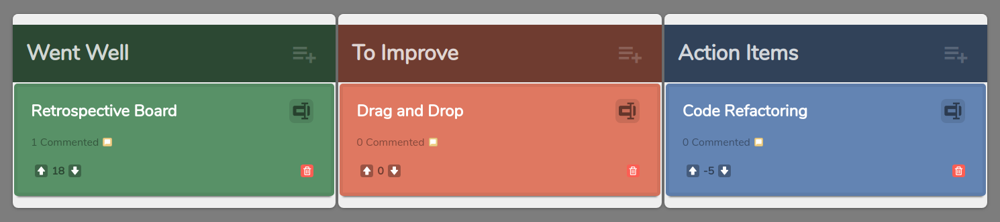

# Retro-Board

Simple [retrospective](https://en.wikipedia.org/wiki/Retrospective) board tool build on [React](https://reactjs.org/).

## Getting Started

These instructions will get you a copy of the project up and running on your local machine for development and testing purposes. See deployment for notes on how to deploy the project on a live system.

### Prerequisites

[NodeJS](https://nodejs.org/en/about/releases/) v12.14.1

Start by cloning the repository.

```
git clone https://github.com/roramigator/retro-board
```

### Installing

Follow this steps to get a development environment running.

Install dependencies.

```
yarn install
```

Use the development server to test the app.

```
yarn start
```



## Deployment

Although functional, this is just a **concept**; it could be *improved* but is not ready for production. All feedback is welcomed.

## Built With

* [ReactJS](https://reactjs.org/docs/getting-started.html) - The web framework used
* [Yarn](https://classic.yarnpkg.com/en/docs) - Dependency Management

## Authors

* **Roberto Morado** - *Initial work* - [roramigator.dev](https://roramigator.dev)
